Project by SAHIL JADHAV

To run the project, follow these steps:

Download the zip file and extract it.
Install Python on your system. -
Install the Django framework by running the command: pip install django .
Install an editor such as PyCharm and/or VSCode.
Open either PyCharm or VSCode.
In PyCharm:

Navigate to the extracted project folder.
Open the project in PyCharm.
Open the terminal in PyCharm.
In VSCode:

Open the extracted project folder directly in VSCode.
Open the integrated terminal in VSCode.
In the terminal, install the required packages by running the following commands using pip:

For Example:

pip install numpy
pip install python-dateutil
pip install Pillow
(Install any other required packages in a similar manner)

Apply the database migrations by running the command: python manage.py migrate.
Finally, execute the command: python manage.py runserver to run the project.
Copy the localhost URL (e.g., http://127.0.0.1:8000/) and paste it into the browser's address bar, then press Enter

# OUTPUT

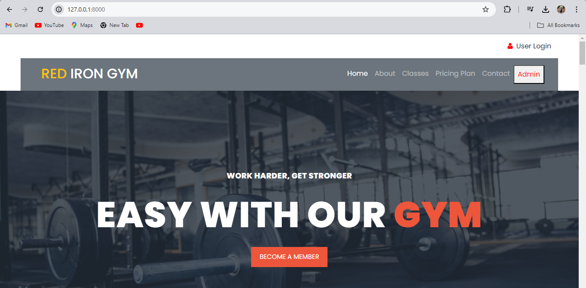

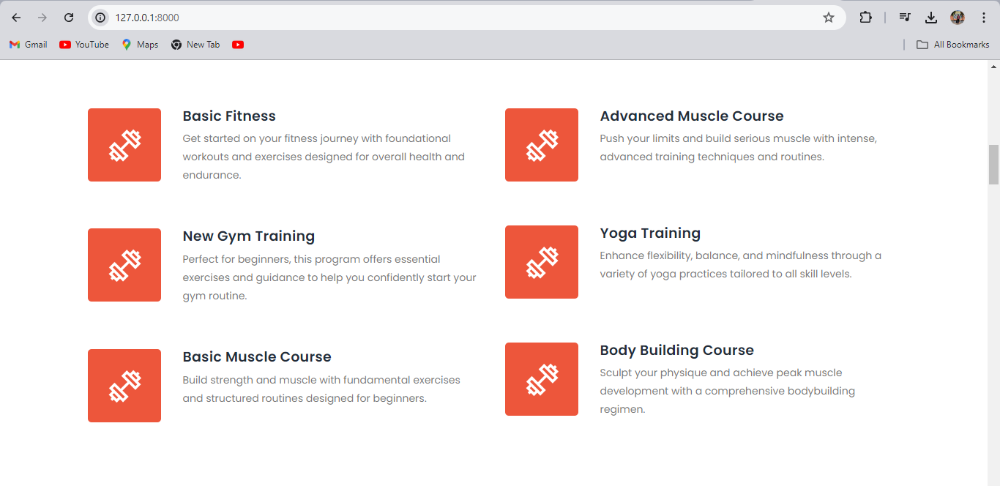

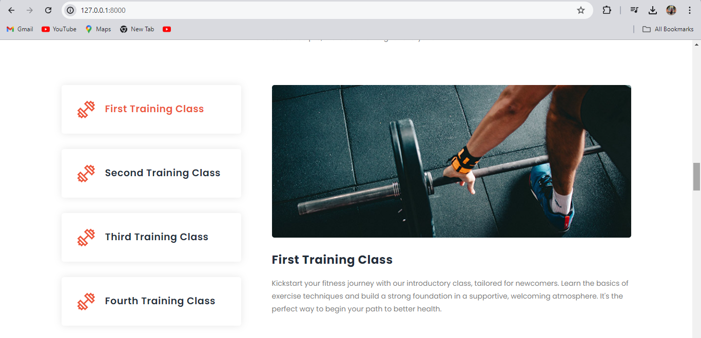

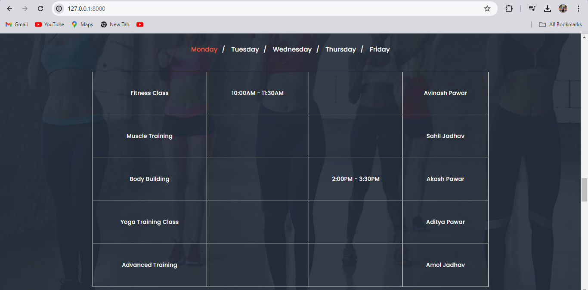

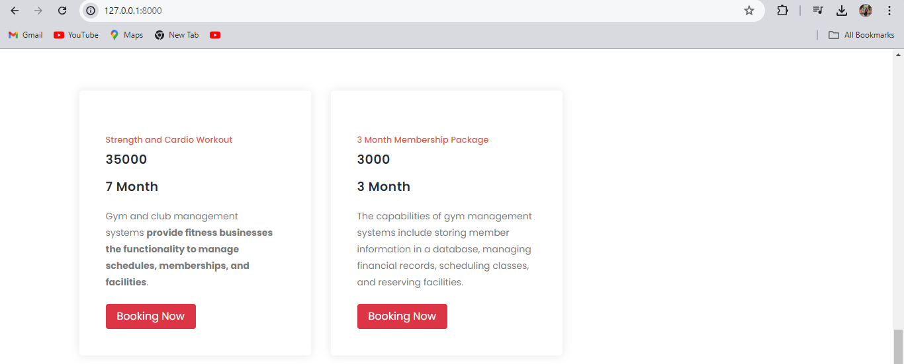

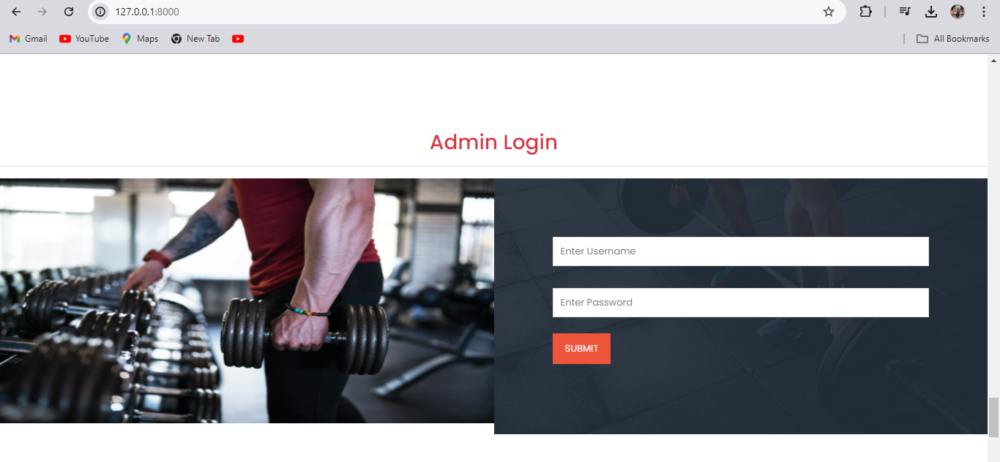

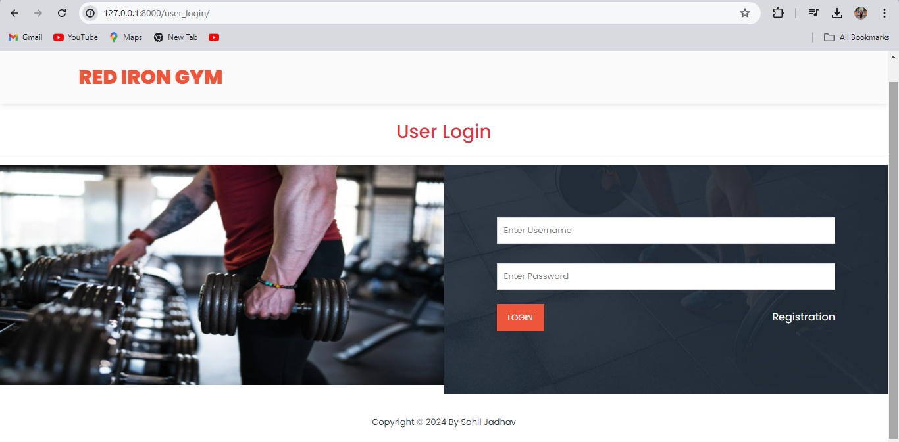

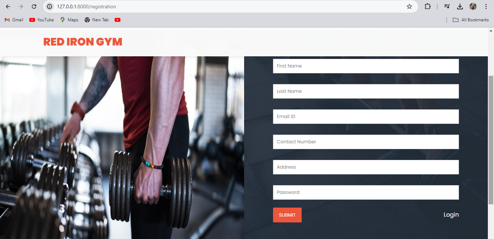

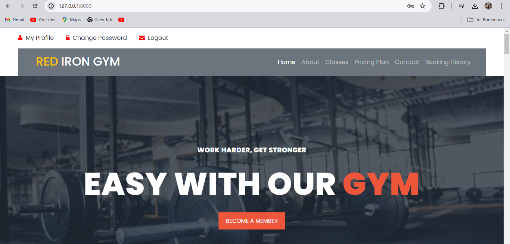

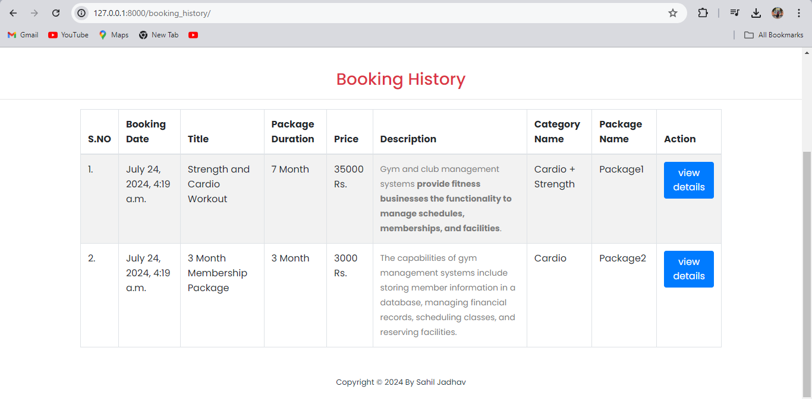

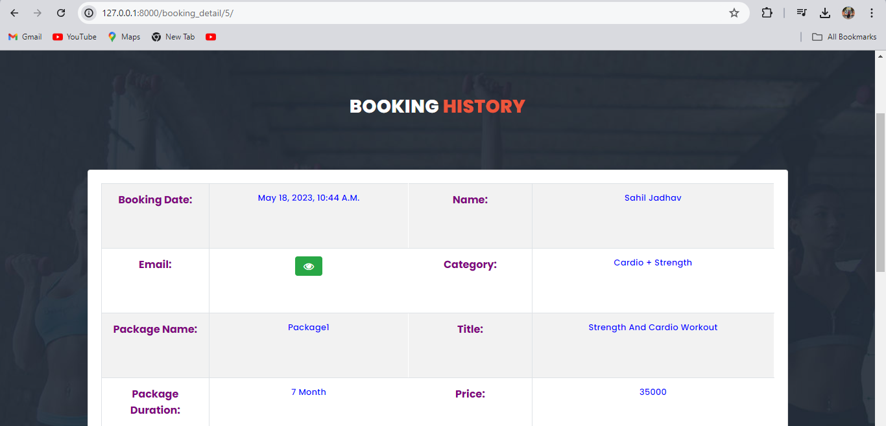

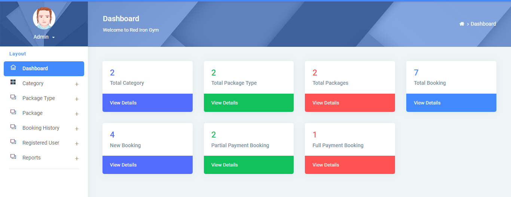

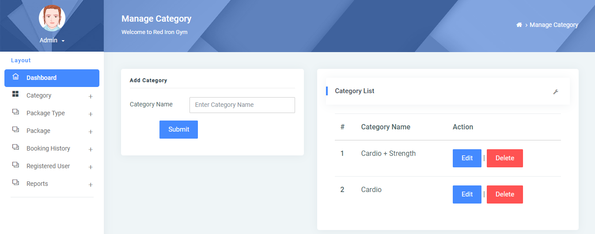

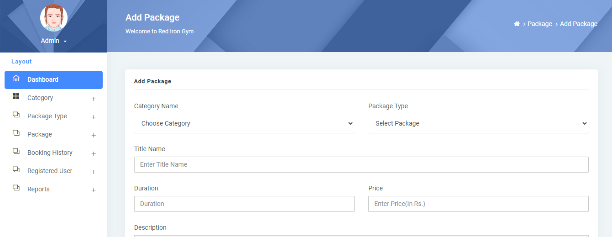

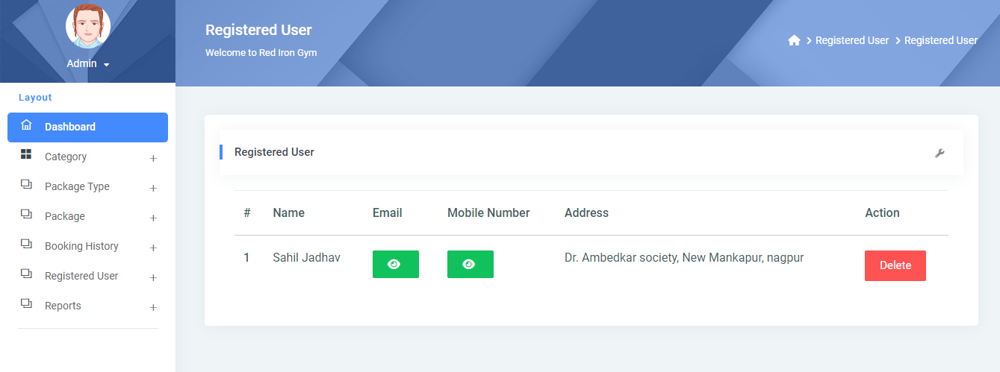

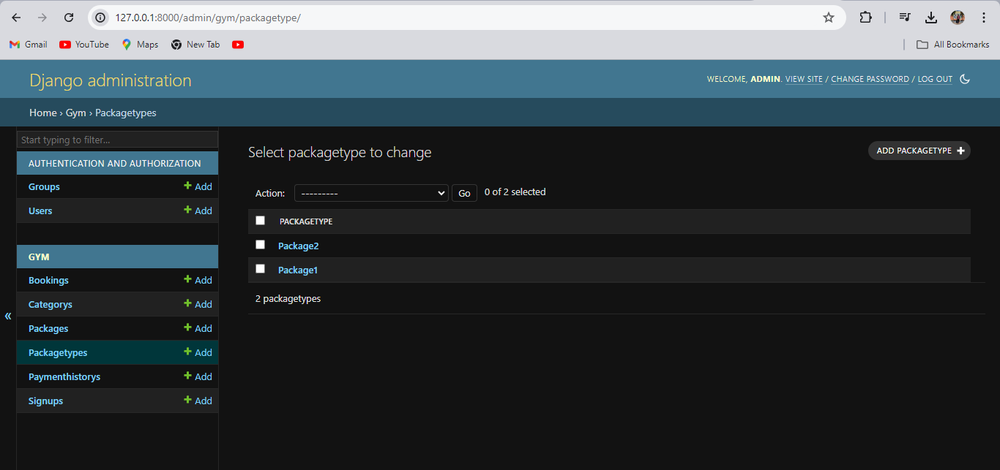